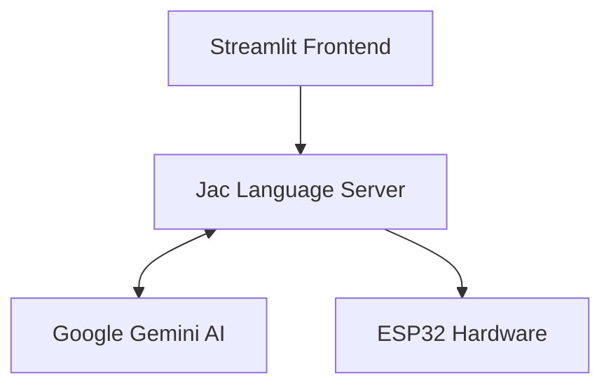

# 🎙️ Intelligent Command-Controlled LED System

An intelligent IoT system that combines natural language processing, edge computing, and intelligent command interpretation to control LED lights through text commands. Built with **Jac Language**, **Google Gemini AI**, **ESP32**, and **Streamlit**.

---

## 🎯 Overview

This project demonstrates a sophisticated text-command-controlled IoT system that interprets natural language commands in multiple languages (English, Sinhala, Singlish) and translates them into precise hardware actions. Unlike traditional voice assistants that rely on pre-programmed wake words and limited command sets, this system uses advanced AI to understand context, intent, and timing from conversational language.

### 🌟 Key Features

- **🌍 Multi-language Support**: Understands English, Sinhala, and Singlish commands
- **⏰ Time-based Control**: Schedule actions with natural language timing ("turn off after 2 minutes")
- **🎨 Multi-color LED Control**: Control RED, GREEN, and BLUE LEDs independently
- **🧠 Intelligent Parsing**: Uses Google Gemini AI for natural language understanding
- **📱 Web Interface**: User-friendly Streamlit dashboard
- **🔗 Real-time Communication**: Direct ESP32 integration for instant response
- **🔧 Modular Architecture**: Easily extensible for additional devices and commands

---

## 🏗️ High-Level Architecture



---

### 🔧 Component Breakdown

1. **Frontend Layer (Streamlit)**
   - User interface for command input
   - Real-time feedback and status updates

2. **Intelligence Layer (Jac + Gemini AI)**
   - Natural language processing and understanding
   - Command parsing and validation
   - Multi-language support

3. **Hardware Layer (ESP32)**
   - Wi-Fi enabled microcontroller
   - LED control with timing mechanisms
   - HTTP server for command reception

4. **Communication Layer**
   - RESTful API communication
   - JSON data exchange
   - Real-time status reporting

---

## 🔄 How It Works

### 1. **Command Input**
User enters a natural language command like:
- "Turn on the green LED"
- "Switch off red light after 30 seconds"
- "කහ LED එක 2 විනාඩියකට පස්සේ නිවන්න" (Sinhala)

### 2. **AI Processing**
The Jac server sends the command to Google Gemini AI which:
- Analyzes the natural language input
- Extracts key parameters: LED color, action (ON/OFF), delay time
- Returns structured JSON: `{led: "RED", command: "ON", delay: 30}`

### 3. **Hardware Execution**
ESP32 receives the structured command and:
- Validates the LED color and command
- Executes immediate actions or schedules delayed actions
- Provides feedback through serial monitoring

---

## ✨ Key Benefits

### 🎯 **Flexibility & Customization**
- **No Wake Words**: No need for "Hey Google" or "Alexa" - direct command processing
- **Custom Commands**: Easily add new devices and command types
- **Language Agnostic**: Support for local languages and dialects

### 🔒 **Privacy & Security**
- **Local Processing**: Commands processed locally, not sent to cloud services continuously
- **No Always-Listening**: Commands are entered when needed, not always monitoring
- **Direct Control**: No dependency on external cloud services for basic operations

### 🛠️ **Developer-Friendly**
- **Open Source**: Full control over the system and customization
- **Modular Design**: Easy to extend and modify
- **Modern Tech Stack**: Built with cutting-edge tools and frameworks

---

## ⚡ Comparison with Traditional Voice Assistants

| Feature | This System | Google Assistant | Amazon Alexa | Apple Siri |
|---------|-------------|------------------|--------------|------------|
| **Wake Word Required** | ❌ No | ✅ "Hey Google" | ✅ "Alexa" | ✅ "Hey Siri" |
| **Multi-language Support** | ✅ English/Sinhala/Singlish | ✅ Limited | ✅ Limited | ✅ Limited |
| **Custom Commands** | ✅ Fully Customizable | ⚠️ Limited | ⚠️ Limited | ⚠️ Very Limited |
| **Privacy** | ✅ Local Processing | ❌ Cloud-based | ❌ Cloud-based | ❌ Cloud-based |
| **Development Cost** | 💰 Low (Open Source) | 💰💰 API Costs | 💰💰 Development Time | 💰💰💰 Ecosystem Lock-in |
| **Customization Level** | 🔧 Complete Control | 🔧 Limited | 🔧 Moderate | 🔧 Very Limited |

### 🎯 **Unique Advantages**

1. **No Vendor Lock-in**: Complete control over the system without dependency on Google, Amazon, or Apple ecosystems
2. **Local Language Support**: Can easily add support for any language or dialect
3. **Direct Hardware Control**: No need for cloud APIs or third-party integrations
4. **Cost Effective**: No monthly subscriptions or API usage fees for basic operations

---

## 🧬 Why Jac Language?

Jac offers unique advantages for this IoT voice control system:

### 🎯 **AI-First Design**
- **Built-in LLM Integration**: Native support for AI/ML models with simple syntax

### 🔧 **IoT-Optimized Features**
```jac
# Simple LLM integration - no complex API handling
def generate_command(user_input: str) -> dict byllm();

# Built-in REST API generation
obj __specs__ {
    static has methods: list = ["post"];
    static has auth: bool = False;
}
```

### 🚀 **Development Benefits**

1. **Rapid Prototyping**: Less boilerplate code compared to Python/Node.js
4. **Maintainability**: Clean, readable syntax reduces technical debt

---

## 🚀 Future Development Ideas

- **Voice Input Integration**: Add speech-to-text for true voice control
- **Mobile App**: Native iOS/Android app with voice recording
- **Command History**: Store and replay previous commands
- **Multi-Device Support**: Control multiple ESP32 devices simultaneously
- **Smart Home Integration**: Connect with other IoT devices (sensors, cameras, appliances)
- **Context Awareness**: Remember previous commands and current device states
- **Cloud Deployment**: Scalable cloud version for multiple users

---

## 🛠️ Technologies Used

### **Core Framework**
- **🧬 Jac Language** - AI-first programming language for intelligent applications
- **🤖 Google Gemini 2.5 Flash** - Advanced natural language processing and understanding
- **🐍 Python 3.10+** - Backend runtime and Streamlit frontend
- **📱 Streamlit** - Rapid web application development framework

### **Hardware & IoT**
- **📡 ESP32** - Wi-Fi enabled microcontroller for hardware control
- **🔌 Arduino IDE** - Development environment for ESP32 programming
- **💡 RGB LEDs** - Hardware output devices for visual feedback

### **Communication & APIs**
- **🌐 HTTP/REST** - Communication protocol between components
- **📄 JSON** - Data exchange format for command structure
- **📊 ArduinoJson** - JSON parsing library for ESP32

### **Development Tools**
- **🔧 VS Code** - Recommended IDE with excellent Jac support
- **📦 Jaseci Runtime** - Required runtime for executing Jac programs
- **🐙 Git** - Version control and collaboration

---

## ⚙️ Setup & Installatio

### 🚀 **Running the System**

1. **Start Jac Server**:
```powershell
cd c:\Users\user\Desktop\streamlit
jac serve new.jac
```

2. **Launch Streamlit Frontend**:
```powershell
streamlit run client.py
```

3. **Access the Application**:
   - Open browser to `http://localhost:8501`
   - Ensure ESP32 is connected to Wi-Fi
   - Update ESP32 IP address in `client.py` if needed

---

## 📄 License

This project is licensed under the MIT License - see the [LICENSE](LICENSE) file for details.
